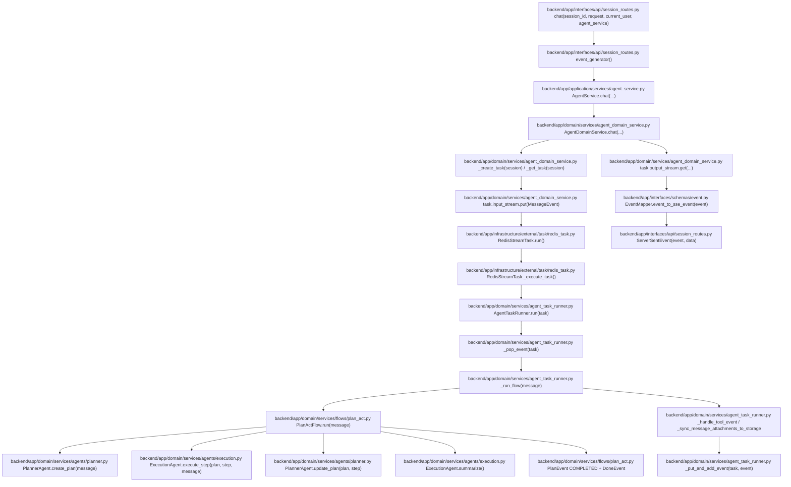

# Chat 流程图

```mermaid
flowchart TD
    A["backend/app/interfaces/api/session_routes.py chat(session_id, request, current_user, agent_service)"] --> 
    B["backend/app/interfaces/api/session_routes.py event_generator()"]

    B --> C["backend/app/application/services/agent_service.py AgentService.chat(...)"]
    C --> D["backend/app/domain/services/agent_domain_service.py AgentDomainService.chat(...)"]

    D --> D1["backend/app/domain/services/agent_domain_service.py _create_task(session) / _get_task(session)"]
    D1 --> D2["backend/app/domain/services/agent_domain_service.py task.input_stream.put(MessageEvent)"]
    D2 --> D3["backend/app/infrastructure/external/task/redis_task.py RedisStreamTask.run()"]

    D3 --> E["backend/app/infrastructure/external/task/redis_task.py RedisStreamTask._execute_task()"]
    E --> F["backend/app/domain/services/agent_task_runner.py AgentTaskRunner.run(task)"]

    F --> F1["backend/app/domain/services/agent_task_runner.py _pop_event(task)"]
    F1 --> F2["backend/app/domain/services/agent_task_runner.py _run_flow(message)"]

    F2 --> G["backend/app/domain/services/flows/plan_act.py PlanActFlow.run(message)"]
    G --> G1["backend/app/domain/services/agents/planner.py PlannerAgent.create_plan(message)"]
    G --> G2["backend/app/domain/services/agents/execution.py ExecutionAgent.execute_step(plan, step, message)"]
    G --> G3["backend/app/domain/services/agents/planner.py PlannerAgent.update_plan(plan, step)"]
    G --> G4["backend/app/domain/services/agents/execution.py ExecutionAgent.summarize()"]
    G --> G5["backend/app/domain/services/flows/plan_act.py PlanEvent COMPLETED + DoneEvent"]

    F2 --> F3["backend/app/domain/services/agent_task_runner.py _handle_tool_event / _sync_message_attachments_to_storage"]
    F3 --> F4["backend/app/domain/services/agent_task_runner.py _put_and_add_event(task, event)"]

    D --> H["backend/app/domain/services/agent_domain_service.py task.output_stream.get(...)"]
    H --> I["backend/app/interfaces/schemas/event.py EventMapper.event_to_sse_event(event)"]
    I --> J["backend/app/interfaces/api/session_routes.py ServerSentEvent(event, data)"]
```
